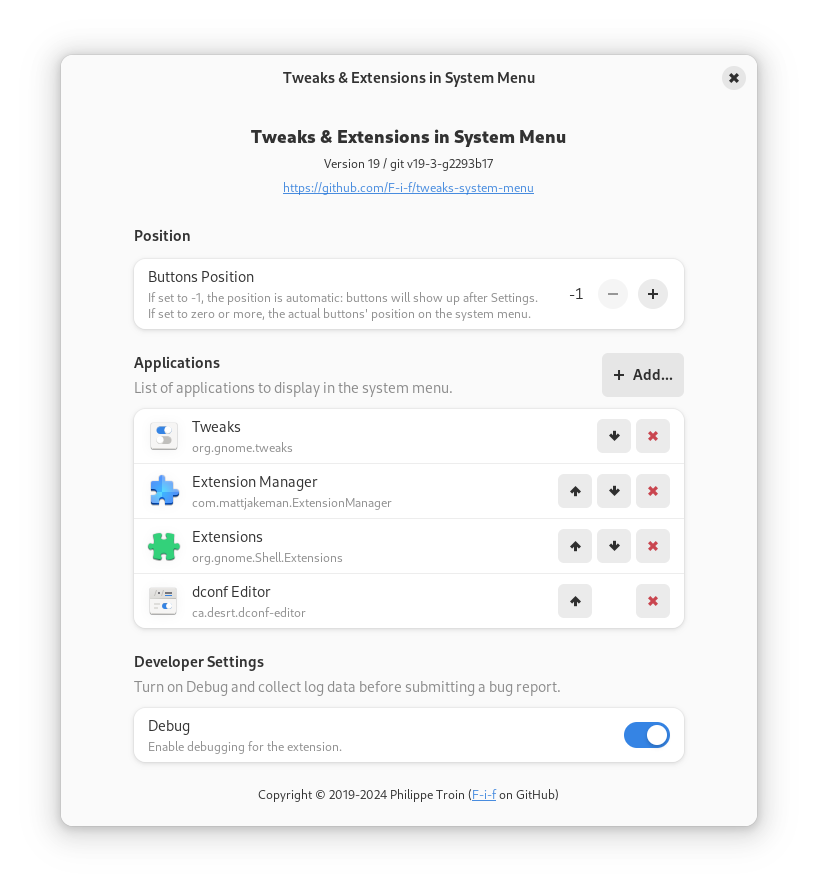

Tweaks and Extensions in System Menu Gnome Shell Extension
===========================================================

## Overview

Tweaks in System Menu adds shortcut buttons to panel's system menu.
By default, _Gnome Tweaks_ (a.k.a. _Tweak UI_), _Extensions_, and
_Extension Manager_ are added, but the list of applications to display
can be changed in the preferences.


The buttons can be positioned anywhere in the system menu.

## Configuration

Tweaks in System Menu comes with a preference panel which can be found
from the _Extensions_ or _Extension Manager_ applications or the
[Gnome Shell Extensions page](https://extensions.gnome.org/local/).



## License

Tweaks in System Menu is free software: you can redistribute it and/or
modify it under the terms of the GNU General Public License as
published by the Free Software Foundation, either version 3 of the
License, or (at your option) any later version.

This program is distributed in the hope that it will be useful, but
WITHOUT ANY WARRANTY; without even the implied warranty of
MERCHANTABILITY or FITNESS FOR A PARTICULAR PURPOSE.  See the GNU
General Public License for more details.

You should have received a copy of the GNU General Public License
along with this program.  If not, see [http://www.gnu.org/licenses/].

## Download / Install

Install directly from the [Gnome Shell Extensions
site](https://extensions.gnome.org/extension/1653/tweaks-in-system-menu/).

Or download the [zip file](https://github.com/F-i-f/tweaks-system-menu/releases/download/v23/tweaks-system-menu@extensions.gnome-shell.fifi.org.v23.shell-extension.zip) from the GitHub [releases
page](https://github.com/F-i-f/tweaks-system-menu/releases) and run:

``` shell
gnome-extensions install tweaks-system-menu@extensions.gnome-shell.fifi.org.v23.shell-extension.zip
```

## Building from source

### Requirements

- [meson](http://mesonbuild.com/) v1.4.0 or later.

### Running the build

- Check out: `git clone --recurse-submodules https://github.com/F-i-f/tweaks-system-menu`

- `cd tweaks-system-menu`

- Run meson: `meson setup build`

- To install in your your gnome shell extensions' directory (~/.local/share/gnome-shell/extensions), run ninja: `ninja -C build install`

- To build the extension zip files, run: `ninja -C build extension.zip`, the extension will be found under `build/extension.zip`.

## Changelog

### Version 23
#### September 11, 2024

- Gnome Shell 47 compatibility.
- Update meson-gse:
  - Now requires meson 1.4.0 or later.
  - Build now runs eslint on test, added prettier target.
- Update to pass eslint.
- Code reformatted with prettier.

### Version 22
#### June 3, 2024

- Update Dutch translation by Heimen Stoffels (@Vistaus).
- Minor punctuation fixes in other translations.

### Version 21
#### May 26, 2024

- Fix race condition at shell start-up.

### Version 20
#### May 25, 2024

- Now supports adding any application to the system menu.
- Defaults to adding _Gnome Tweaks_, _Extensions_, and _Extension
  Manager_.
- The preferences dialog has been reimplemented with the Adwaita
  toolkit.
- Settings from previous versions will be lost upon upgrade.

### Version 19
#### May 20, 2024

- Gnome Shell 45 & 46 compatibility.
- Add translation for:
  - Czech (courtesy of @Amereyeu).
- Now incompatible with all older Gnome Shell lower than 45.
	- Gnome Shell 43 and 44 are not supported.
	- Version 18 works for Gnome Shell 3.36 through 42.
	- Version 8 works for Gnome Shell 3.28 through 3.34.

### Version 18
#### March 12, 2022

- Gnome Shell 42 compatibility.
- Update instructions to use `gnome-extensions` instead of manually
  unzipping.

### Version 17
#### December 22, 2021

- Declare compatibility with version 40 and 41 of Gnome Shell instead
  of using minor versions (40.0 and 41.1).  This should clear reports
  of the extension being incompatible with well-supported versions.
- Update Japanese translation (thanks to @yukkeorg).
- Update meson-gse:
  - Fix build issues with meson 0.60.0.
  - Bump minimum meson version to 0.50.0.
- Clean up code:
  - Remove Lang imports.
  - Use ExtensionUtils for getSettings/initTranslations instead of
	using meson-gse's convenience.js.

### Version 16
#### December 18, 2021

- Gnome-shell 41 compatibility.
- Add translations for:
  - Dutch (courtesy of @Vistaus).
  - Japanese (courtesy of @yukkeorg).
  - Korean (courtesy of @kuroehanako).
  - Spanish (courtesy of @fjsevilla-dev).
- Improve Gnome Extensions detection (courtesy of @stefangweichinger).

### Version 15
#### March 27, 2021

- Update and generalize German translation.

### Version 14
#### March 26, 2021

- Support showing both Tweaks and Extensions (Extensions only on Gnome
  40 and later).
- Update meson-gse to latest:
  - Fix logging bug in preferences.

### Version 12 & 13
#### March 25, 2021

- Gnome-shell 40 compatibility.
- Update preferences for Gnome-shell 40.
- Update meson-gse to latest:
  - Now prints the GJS version in the system log at start-up (if debug
	is enabled).
  - Support more mozjs version (78, 68, 52) for build-time syntax
	checks (`ninja test`).

### Version 11
#### October 6, 2020

- Declare gnome-shell 3.38 compatibility (no code changes required).

### Version 10
#### May 12, 2020

- Update German translation.

### Version 9
#### March 11, 2020

- Gnome-shell 3.36 compatibility:
  - The Tweaks entry cannot be merged with Settings anymore.
  - This version is not compatible with earlier shell versions (use
	version 8 for Gnome Shell 3.34 and below).
- Fix deprecation warning in preferences.
- Update meson-gse to latest.
- Now prints the gnome-shell version and the session type on start-up.

### Version 8
#### October 15, 2019

- Update German translation.

### Version 7
#### October 11, 2019

- Add German translation.

### Version 6
#### September 30, 2019

- Declare compatibility with shell version 3.34 (no code changes required).

### Version 5
#### August 21, 2019

- Declare compatibility with shell version 3.33.90.
- No functional changes.

### Version 4
#### August 19, 2019

- Supports shell version 3.33 (new compatibility code).
- Also declare as compatible with shell version 3.28 (no new code needed).
- Code clean-ups without any user-visible changes in the preference pane.
- Added Travis CI support in build tree.

### Version 3
#### March 30, 2019

- Fix warning in logger.js that was introduced in version 2.

### Version 2
#### March 26, 2019

- ES6 / Gnome-Shell 3.32 compatibility (still compatible with 3.30 and lower).
- Updated meson-gse to latest.
- Minor doc updates.

### Version 1
#### February 11, 2019

- Initial release.

## Credits

- The [`meson-gse` credits](https://github.com/F-i-f/meson-gse/) are
  included here by reference.
- Inspiration for `AltSwitcher()` usage com from the [Hibernate Status
  Button](https://extensions.gnome.org/extension/755/hibernate-status-button/)
  extension.
- German translation by [Etamuk](https://github.com/Etamuk).

<!--  LocalWords:  UI cd extensions' Changelog gse AltSwitcher js ES6
-->
<!--  LocalWords:  MERCHANTABILITY Etamuk GJS mozjs Vistaus yukkeorg
 -->
<!--  LocalWords:  kuroehanako fjsevilla dev stefangweichinger gse's
 -->
<!--  LocalWords:  ExtensionUtils getSettings initTranslations
 -->
<!--  LocalWords:  Amereyeu reimplemented Adwaita
 -->
